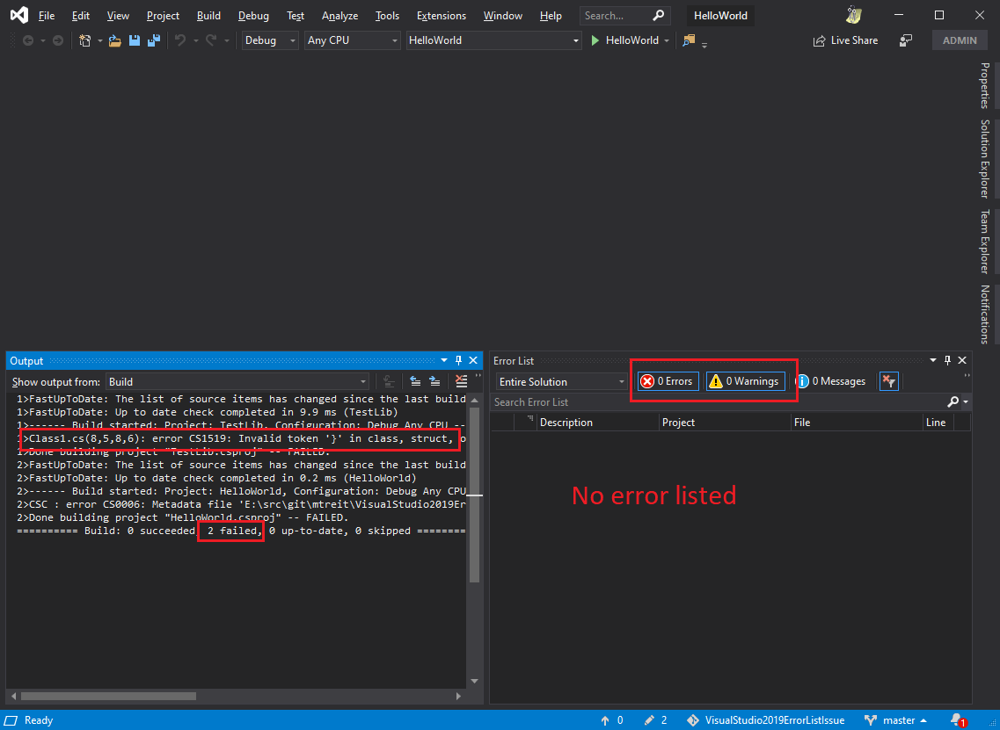

# Visual Studio 2019 Error List Issue
The trivial hello world project in this repo illustrates an issue where Visual Studio 2019 does not populate the error list properly when a project fails to build.

The SampleLib project is intentionally broken: it does not build because of some invalid code.

However, if you open HelloWorld\HelloWorld.sln in Visual Studio 2019 and build the solution (F6), the Error List window in Visual Studio does not populate.

It is not until you browse to the file that has the problem that Visual Studio actually populates the Error List window.

This issue does not reproduce if you open the solution in Visual Studio 2017.
